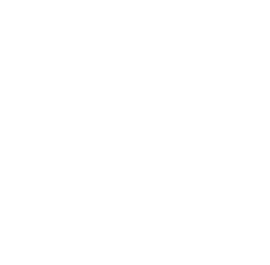
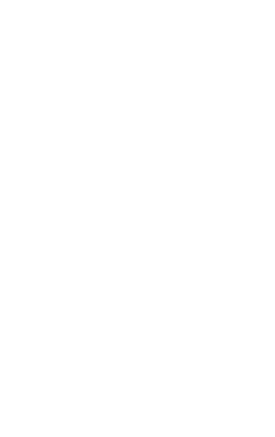

+++
title = "SU-CS143 APR032025"
author = ["Houjun Liu"]
draft = false
+++

**how to design a language**: "why don't we just make a truing machine?" tl;dr: "writing code in a Turing Machine takes a while, writing it in C++ takes a little less while."

-   languages fills a void: makes something previously difficult/impossible easy
-   good languages vs. language design needs are orthogonal things


## why do we not change languages? {#why-do-we-not-change-languages}

-   rewriting code is hard
-   languages with many users are replaced rarely --- popular languages are ossified
-   so people just go start new niches


## language vs. ends {#language-vs-dot-ends}

-   SQL: query optimizations by separating data query vs. access pattern (inserting indexes w/o rewrite code)
-   Python: library composition / FFI
-   Haskell: proofs and type safety
-   Rust: security


## language design {#language-design}

-   no universally accepted metrics for design
-   claim: "a good language is the one that people use" ("I don't really buy that, because otherwise PHP would be the best language" - Fred 2025)


### abstraction {#abstraction}

**abstraction** --- detaching high level problems from functional details, "selective ignorance".

-   key is **information hiding**: expose only the essential things
-   leave **high level properties**

To create abstractions, we...

-   **use languages and compilers**: create high level code with few dependencies specific to machines
-   **use functions**: allows users to create interfaces to behavior
-   **use modules**: export interfaces and hide implementations
-   **use classes / ADTs**: bundle data with its operations


### some good ideas {#some-good-ideas}


#### types {#types}

"types is used to enforce abstractions"

-   FORTRAN: scalars, arrays, and that's it
-   LISP: no static type distinctions

**insight**: types are helpful!

-   they let you express and enforce your own abstractions
-   they let the compiler report frequent errors
-   ...up to complete safety (Java, Haskell, Lean, etc.)
-   helps guide optimization


#### reuse {#reuse}

Exploit common platter in software systems (to get mass-produced components and reuse).

-   type parameterizations: (List[int], List[double])
-   classes and inheritance: derived classes
-   C++ and Java has both!

During class derivations, good approaches mostly emit the code multiple times for each specialization. Inheritance allows:

-   specialization of existing abstraction
-   extension, modification, hidden behavior, etc.


## COOL {#cool}

We will implement [COOL](#cool) in this class; written by Alex in the 90s.

-   abstraction
-   static typing
-   inheritance
-   strict object orientation (everything is in a class)
-   memory management (with GC (oh no)!)
-   light metaprograming


### A Tour {#a-tour}

```java
class Point {
    x : Int <- 0;
    y : Int <- 0;
};
```

Inside class `Main`, there's a special method `main`. All COOL code lives inside this evaluation.

-   class = {attributes, methods}
-   instances of classes are objects

<!--listend-->

```java
class Point {
    x : Int < - 0;
    y : Int; (* could have default values *)
};
```

Objects are thought of as records

```dot
digraph {
graph [bgcolor=transparent];
node [fontcolor=white, color=white, shape=none];
edge [fontcolor=white, color=white];

a [label="{{x|y} | {0|0}}", shape="record"];
}
```






#### classes {#classes}

Classes can only contain features = {attributes, methods}. Here's a class both types of features:

```java
class Point {
    x : Int <- 0;
    y : Int <- 0;
    movePoint(newx : Int, newy : Int) : Point {
        {
            x <- newx;
            y <- newy;
            self;
        } --- this is a block
    };
};
```

Cool, therefore, is a an **expression based language** (a la Rust).

Key: one block per expression; notice how we had to surround the block in additinal curlies.

Some facts:

-   shadowing is allowed
-   methods are all **GLOBAL/PUBLIC**
-   attributes are all **LOCAL/PRIVATE** (make getters)
-   all attributes of a class are visible to all methods of that class (just use the name)


#### allocation {#allocation}

When we have a method, we put in the field a pointer to the actual function.





As an optimization, if multiple instances exist, we create a method table or a **vtable** which points to all methods.






#### inheritance {#inheritance}

```java
class ColorPoint inherits Point {
    color : Int <- 0;
    movePoint(newx : Int, newy : Int): Point {{
        color <- 0;
        x <- newx;
        y <- newy;
        self;
    }};
};
```

notice how `movePoint` still returns a `Point` because we don't have multiple dispatch.


#### types {#types}

Every class is a type.

-   base classes: Int, Bool, String, Object (root of the hierachy)
-   everything must be declared (the complier infers types)


#### type checking {#type-checking}

```java
x : A;
x <- new B:
```

is well typed if `A` is an ancestor of `B`.


#### invocation {#invocation}

Consider:

```java
p : Point;
p <- new ColorPoint;
...
p.movePoint(1,2); -- this should invoke the ColorPoint version
```

So, consider:

```java
e.m(a)
```

the evaluation semantics:

1.  evaluate arguments `a`
2.  evaluate `e`, the receiver
3.  find the class of `e`
4.  find code of `m` (to jump through the method table to the methods of `e` to find `m`) --- we have to do this dynamically because we don't know (see example above) whether this is a point or color point or whatever
5.  bind `self` and arguments (such as `a`, the formal parameter, to the actual parameter, x)
6.  jump and run the actual method


#### expression language, so {#expression-language-so}



we don't have...

-   arrays
-   floats
-   exceptions
