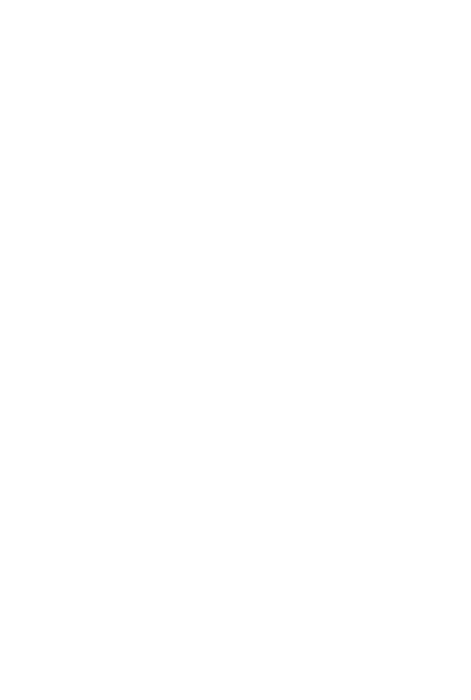

+++
title = "SU-PHIL2 APR012025"
author = ["Houjun Liu"]
draft = false
+++

Challenge of moral philosophy: a system which resolves morality and ethics together.

## tools {#tools}

-   definitions
-   appearance vs. reality (descriptive vs. true values)
-   reflective equilibrium

---

## morality {#morality}

[morality](#morality) is paradimatically a set of rules/expectations (concerning character/motives/emotions) for right/wrong behavior.

A code of conduct that people "must" follow to...

-   regulate / guide interpersonal interactions
-   rules that concern...
    -   harm / benefit
    -   justice / fairness
    -   loyalty / obedience
    -   sanctity / purity

**Key question of morality**: what do we owe to each other? what do I owe other people?

### example {#example}

#### twelve commandments {#twelve-commandments}

1.  no other gods
2.  no idols
3.  no swearing
4.  keep sabbath holy
5.  honor parents
6.  don't murder
7.  don't commit adultery
8.  no stealing
9.  no lying
10. no coveting

### descritive morality {#descritive-morality}

what people think or believe is right and wrong

-   privileging some kind of in-group

### true morality {#true-morality}

what is right and wrong

## ethics {#ethics}

-   what's a good life?
-   how should I live?
-   what should I do, all things considered?

that is, ethics considers [morality](#morality), etc but also beauty, etc.

## modern morality {#modern-morality}

Modern [morality](#morality) has four typical features:

-   "universal" --- applies to everyone
-   "impartial / egalitarian" --- everyone counts the same, everyone is "equally real"
-   "inescapable" --- you can't ot out
-   "overriding" --- morality is important, moral considerations are weighty + need to be taken seriously ("always beat others")

## theory {#theory}

Why do we need theory?

1.  identify the "correct" rules / principles in a systematic way
2.  we want to know why these "correct" rules are correct
3.  why be moral?
4.  how do we know any of this? what's the methodology?

### coherentism {#coherentism}

A [coherentism](#coherentism) is looping belief that forms the basis of a belief.

#### Agrippa's Trilemma {#agrippa-s-trilemma}

Beliefs help justify observations.



### reflective equilibrium {#reflective-equilibrium}

once figure above reaches equilibrium, that's [reflective equilibrium](#reflective-equilibrium)
